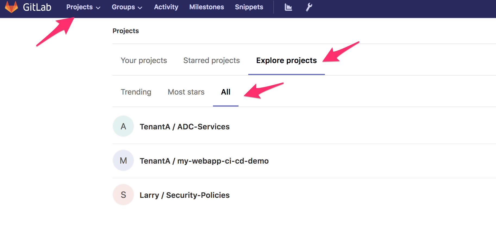
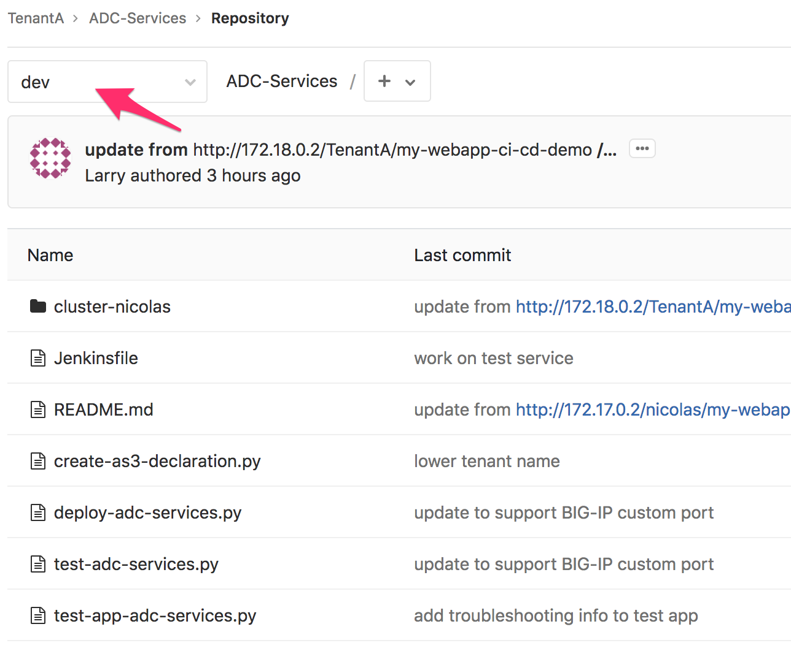
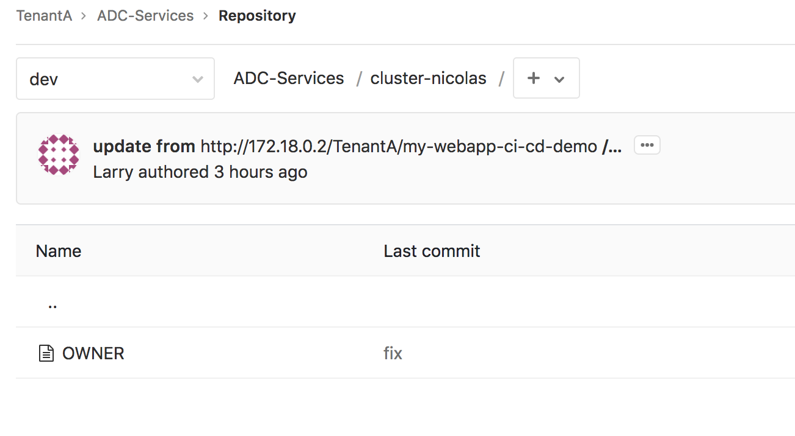
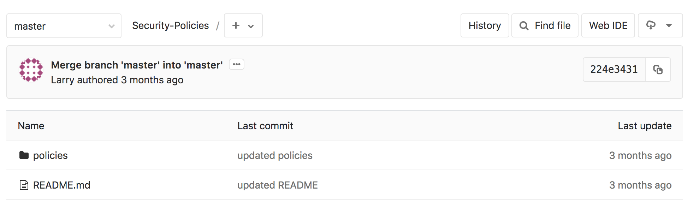
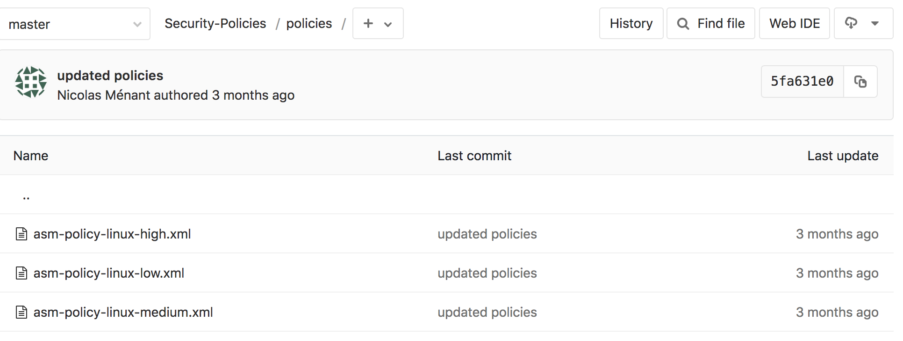

Review Gitlab setup
-------------------

We have setup the following in GitLab: 

* A Tenant/User called **TenantA**. It hosts all the applications and adc services tied to this tenant.
  You can have multiple applications owned by this user and multiple BIG-IP/ADC services here. 
  For this demo, we will use two different repos in **TenantA**: *my-webapp-ci-cd-demo* and *ADC-Services* 
* Another Tenant/User called **Larry**. It hosts all the *Web Application Firewall* policies that people
  can leverage/consume. 

Connect to your Gitlab. It should be http://<IP of your VM>:1080/

* Login: root
* Password: Pa55w0rd

Click on *Projects* > *Explore Projects* > *All*

**my-webapp-ci-cd-demo** contains the application definition and the *ADC services* we want to attach to it. 
It leverages the AS3 definition of a service. It is owned by the user/group called *TenantA*

**ADC Services** contains all the services tied to this User/Tenant. It will contain all the different services needed 
by the application defined in this tenant. It is owned by the user/group called *TenantA*

.. note:: it is worth highlighting that in each repo, we leverage the dev branch. The idea is to explain how you can
    create a CI/CD pipeline for the dev branch and replicate the same process for the *master* or *prod* branch. For this 
    demo, we will use the dev branch. Make sure to select the right branch when browsing *GitLab*. 

**Security-Policies** contains all the approved *Web Application Firewall* policies. People can retrieve them to use on their 
WAF solution. It is owned by the user/group called *Larry*

Gitlab setup - my-webapp-ci-cd-demo
^^^^^^^^^^^^^^^^^^^^^^^^^^^^^^^^^^^

Once you've selected the *dev* branch, you should see different folders in the **my-webapp-ci-cd-demo** repo. 

.. image:: ../../_static/class1/module1/img002.png
    :align: center
    :scale: 50%
 
* *jenkins*: This is folder that will be consumed by the CI Server. It contains all the right scripts to process this folder and 
  do the app deployment, update the ADC-services repo, ...
* *my-adc-cluster*: this folder will contain the ADC cluster target to host our ADC service. It contains the name of the targetted 
  cluster. Consul will provide us with all the right information related to it: BIG-IP IPs, credentials, 
  ... You will also see the service we want to deploy on our ADC cluster. Take some time to review the service definition. 
  You will see that: we leverage the AS3 service definition schema, pool members are not *yet* defined and that our service 
  definition includes a WAF policy. 

  .. image:: ../../_static/class1/module1/img012.png
    :align: center
    :scale: 50%
 
  The pool member(s) are not defined already because the application is not deployed. In a dynamic environment, you can't guess 
  what the pool member(s) will be. We will need to deploy the application, get the pool member(s) information and update our service 
  definition accordingly. 
* *my-app-definition*: this folder contains the app definition. It contains files that we will use to deploy the app on Openshift: 
  deployment, services, route
* *test*: this folder contains multiple tests to do against the app to ensure it is up and running as expected. 

.. note:: it is worth highlighting that the ADC service definition is based on the AS3 schema 
    but only contains the service definition! not the full tenant definition needed by **AS3**. 
    The whole **AS3** declaration for this tenant is within the **ADC-Services** repo that we will
    review later. 

There is also an important file at the root of the repo: *jenkinsFile*. 
When you trigger a webhook from GitLab to Jenkins, the first thing Jenkins will do is to
retrieve this repo. 
From here, it will process the jenkinsFile to know what to do (there are other ways but that is 
how we will proceed here).  The whole pipeline is defined in this file and it will execute scripts 
in the jenkins folder

Every time this repo is updated, it will trigger an already defined *WebHook*. 
This *WebHook* will trigger a pipeline on the Jenkins server. In your **my-webapp-ci-cd-demo** repo,
Go to *Setting* > *Integration* to review the WebHook defined. 

.. image:: ../../_static/class1/module1/img003.png
    :align: center
    :scale: 50%
 
You can learn more about *WebHooks* here: WebHooks_.

.. _WebHooks: https://docs.gitlab.com/ee/user/project/integrations/webhooks.html

Here you can see that *GitLab* is setup to send a "signal" to:

.. code::

    http://172.18.0.3:8080/project/my-webapp-ci-cd-demo-dev

172.18.0.3 is the IP Address of our container running *Jenkins* (it's a docker network). 
The URI: */project/my-webapp-ci-cd-demo-dev*  defines a project/job/pipeline defined on *Jenkins*. 
This is our pipeline. 

This specific pipeline will be triggered every time we update our **my-webapp-ci-cd-demo** repo.

.. note:: There is a file called *DELETE* at the root of the **my-webapp-ci-cd-demo** repo. This file 
    is needed to do the IaC demo. We will explain this in module2. 

    .. image:: ../../_static/class1/module1/img004.png
        :align: center
        :scale: 30%

Gitlab setup - ADC-Services
^^^^^^^^^^^^^^^^^^^^^^^^^^^

If you go into the repo **ADC-Services** and select the *dev* branch, you should see this: 

Here you should have a folder(s) (here one). Each directory represents a BIG-IP cluster. 
In this case, we have a single cluster called **cluster-nicolas**

.. note:: this cluster is defined in consul so that we can automatically retrieve its IP information,
    credentials and which port is used to access the management interface. We could add more cluster here
    if needed

The different python scripts available here will be used by the *jenkinsFile* to execute the *Jenkins pipeline*
called **adc-services-dev**.

if you check the folder **cluster-nicolas**, you'll see that its empty for now. The reason is that we 
haven't deployed yet an application in this cluster. There is only one file called *OWNER*. 

The main reason for this *OWNER* file was to put something into the folder. If the folder was empty, it wouldn't 
show up in *GitLab*.

We can also check the *WebHook* created by going into *Settings* > *Integration*: 

.. image:: ../../_static/class1/module1/img007.png
    :align: center
    :scale: 30%

.. warning:: There is something really specific about this **ADC-Services** repo: **IT IS NEVER HANDLED MANUALLY**. 
    The expectation here is that the different applications deployed via *GitLab* will automatically update accordingly 
    this repo. This is something we will be able to test/confirm when doing module2. 

Gitlab setup - Larry/Security-Policies
^^^^^^^^^^^^^^^^^^^^^^^^^^^^^^^^^^^^^^

Here there is no *dev* branch. We only have already "approved" security policies that can be consumed by 
the different application teams. They can retrieve those security policies and import them into their *CI/CD pipelines*. 

If you browse this repository, you'll see the following: 

Click on the folder *policies* to see what is available to the application teams.

Here we see that people have access to three different WAF policies. In our demo, we will use the policy called 
*asm-policy-linux-high.xml*.