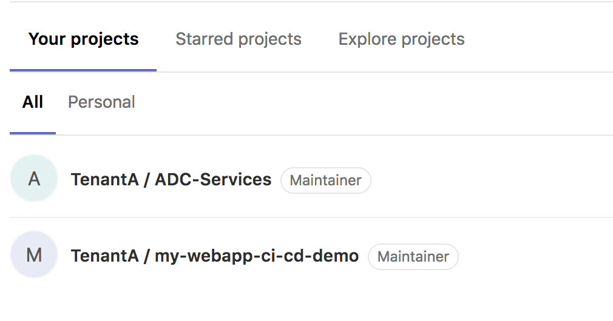

Review Gitlab setup
-------------------
We have setup the following in GitLab: 

* A Tenant/User called **TenantA**. It host all the applications and adc services tied to this tenant.
  You can have multiple applications owned by this user and multiple BIG-IP/ADC services here. 
* For this demo, we will use two different repos in **TenantA**: *my-webapp-ci-cd-demo* and *ADC-Services* 

Connect to your Gitlab. It should be http://<IP of your VM>:1080/

* Login: TenantA
* Password: Pa55w0rd

**my-webapp-ci-cd-demo** contains the application definition and the **ADC Services** we want to attach to it. 
It leverages the AS3 definition of a service. 

**ADC Services** contains all the services tied to this User/Tenant. It will contain all the different services needed 
by the application defined in this tenant. 

.. note:: it is worth highlighting that in each repo, we leverage the dev branch. The idea is to explain how you can
    create a CI/CD pipeline for the dev branch and replicate the same process for the *master* or *prod* branch. for this 
    demo, we will use the dev branch. Make sure to select the right branch when browsing gitlab 

Gitlab setup - my-webapp-ci-cd-demo
^^^^^^^^^^^^^^^^^^^^^^^^^^^^^^^^^^^

Once you've selected the *dev* branch, you should see different folders in the **my-webapp-ci-cd-demo** repo. 

.. image:: ../../_static/class1/module1/img002.png
    :align: center
    :scale: 50%
 
* jenkins: This is folder that will be consumed by the CI Server. It contains all the right scripts to process this folder and 
  do the app deployment, update the ADC-services repo, ...
* my-adc-cluster: this folder will contain the ADC target to host our ADC service. It contains the name of the targetted cluster
  and the ADC service to deploy on it. Consul will provide us with all the right information related to it: BIG-IP IPs, credentials, ...
* my-app-definition: this folder contains the app definition. It contains files that we will use to deploy the app on Openshift: 
  deployment, services, route
* test: this folder contains multiple tests to do against the app to ensure it is up and running as expected. 

.. note:: it is worth highlighting that the ADC service definition is based on the AS3 schema but only contains the service definition! 
    not the full tenant definition needed by **AS3**. The whole **AS3** declaration for this tenant is within the **ADC-Services** repo that we will
    review later. 

There is also an important file at the root of the repo: *jenkinsFile*. When you trigger a webhook from GitLab to Jenkins, the first
thing Jenkins will do it retrieve this repo. From here, it will process the jenkinsFile to know what to do. The whole pipeline is defined 
in this file and it will execute scripts in the jenkins folder

Every time this repo is updated, it will trigger an already defined *WebHook*. This *WebHook* will trigger a pipeline on the Jenkins server

.. image:: ../../_static/class1/module1/img003.png
    :align: center
    :scale: 50%
 
You can learn more about *WebHooks* here: WebHooks_.

.. _WebHooks: https://docs.gitlab.com/ee/user/project/integrations/webhooks.html

