Deploy a new application
------------------------

Prepare the demo
^^^^^^^^^^^^^^^^

Here is the recommended worklow to do this demo. 

Open different tabs in your browser: 

* Open 3 *GitLab* tabs: 

    * one for the **my-webapp-ci-cd-demo** repo. **don't forget to go to the DEV branch** 
      (login: TenantA,Password: Pa55w0rd)
    * one for the **ADC-Services** repo. **don't forget to go to the DEV branch**.
      (Login: TenantA,Password: Pa55w0rd)
    * one for the **Security Policies** repo. (login: root, Password: Pa55w0rd - go to *Projects* > 
      *Explore Projects* > *All*)

* Open 2 *Jenkins* tabs: one for the **my-webapp-ci-cd-demo-dev** project and the other one 
  for the **adc-services-dev** project. **don't forget to go to the DEV branch**. 
* Open 1 tab on your BIG-IP to show its configuration (highlight that there is no *tenanta-dev* partition)
  
  .. note:: if you use the **UDF** Blueprint, the BIG-IP login/password is admin/admin. 

* Open 1 tab on your minishift deployment (*login*: dev, *password*: dev). Go in the *tenanta-dev* project

  .. note:: if you use the **UDF** Blueprint, we can't access directly *Minishift* unfortunately. 
    Use the the **Jumphost** to access *Minishift*

.. WARNING:: if you use F5 private cloud UDF, make sure minishift is up and running. If it's not, check the 
    steps mentioned in the documentation of the blueprint/deployment. You likely need to run again: 
    
    :: 
    
        /home/centos/ci-cd-env-setup/build-env.sh minishift 

    if it doesn't work, you can try the following: 

    :: 

        cd /home/centos/ci-cd-env-setup
        minishift stop
        minishift delete 
        rm -rf minishift
        ./build-env.sh minishift

Make sure that: 

* the *DELETE* file exists in the **my-webapp-ci-cd-demo** repo. 
* the *cluster-nicolas* folder in the **ADC-Services** repo should be empty except for an *OWNER* file. 
* Your BIG-IP configuration doesn't have a *tenanta-dev* partition
* You don't have any App deployed in your minishift system in the tenanta-dev project. 

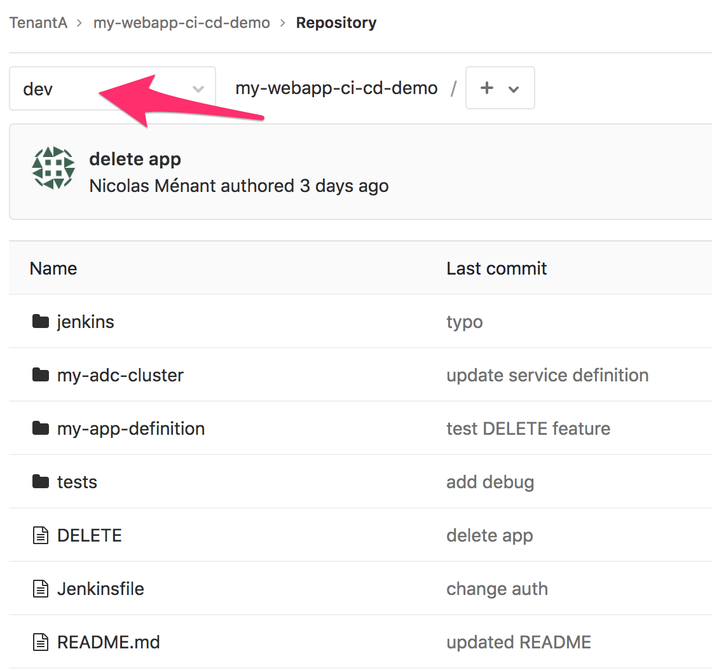

|

.. image:: ../../_static/class1/module2/img007.png
    :align: center
    :scale: 30%

|

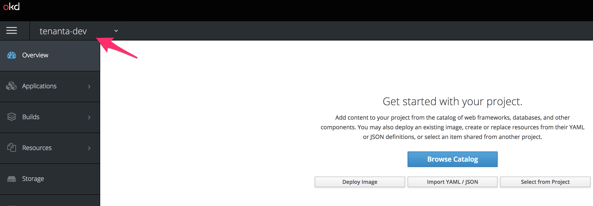

|

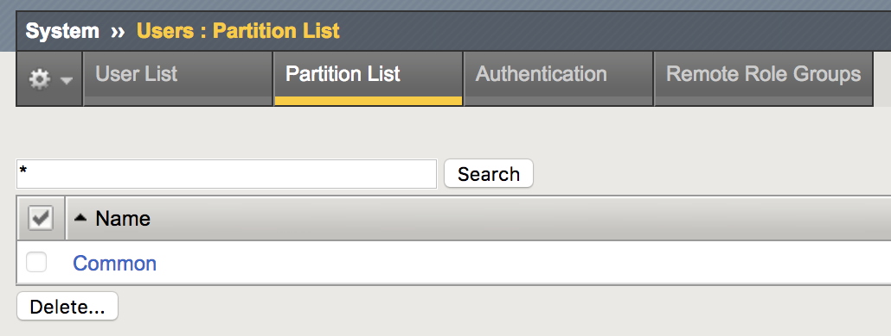

|

Before triggering the application deployment, it may good good to give a brief overview of the setup: 

* Highlights the different DevOps tools used: Gitlab, Jenkins, Consul, Minishift, BIG-IP, AS3 
* Explain what are the 3 *GitLab* repo and who owns each (TenantA is an application owner while Larry 
  is part of the SecOps team). 
* Describe how *WebHooks* will trigger our *Jenkins pipelines*
* Explain how the *my-webapp-ci-cd-demo-dev* *pipeline* will automatically manage the **ADC-Services** repo.
* Explain that the **ADC-Services** repo becomes the "*Source of Truth*" of ADC services deployment (you can 
  talk about *Infrastructure as Code (IaC)* 

Everything is detailed in module1.

Trigger the application deployment
^^^^^^^^^^^^^^^^^^^^^^^^^^^^^^^^^^

In this demo, we use the *DELETE* file to leverage either the APP deployment, or its removal:

* if the *DELETE* file is added to the repo: we will remove the application and its ADC services
* if the *DELETE* file is removed from the repo: we will deploy the application and its ADC services

If everything is up and running as expected, you'll only need to do the following to trigger the deployment 
of the application: 

* Remove the *DELETE* file from the **my-webapp-ci-cd-demo** repo. 
* if you use an editor instead of the GitLab UI, make sure to commit your changes to trigger the WebHook. 

Here is how to do it from the *GitLab* UI: 

* Open the tab showing your **my-webapp-ci-cd-demo** repo and click on the *DELETE* file.
  (make sure to be in the *dev* repo!)

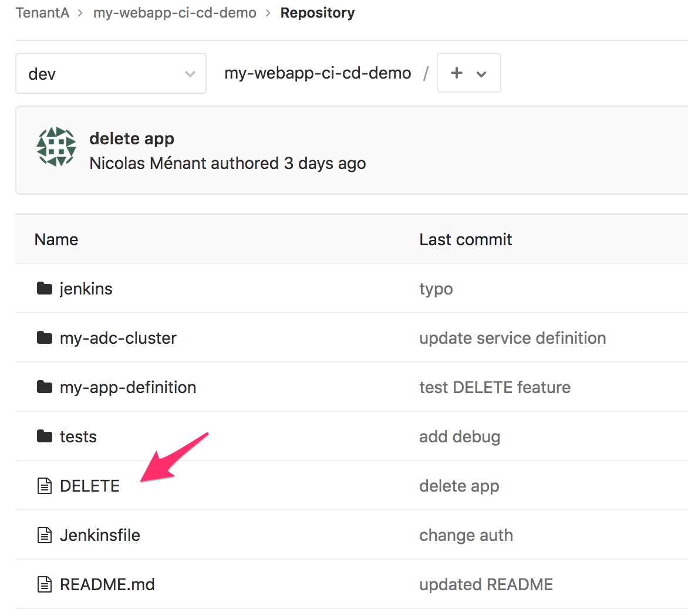

* Click on the red *DELETE* button on the right

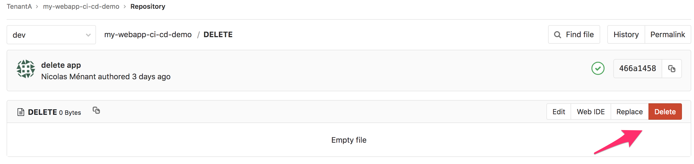

* Confirm that you want to delete the file by clicking on the *Delete File* button.

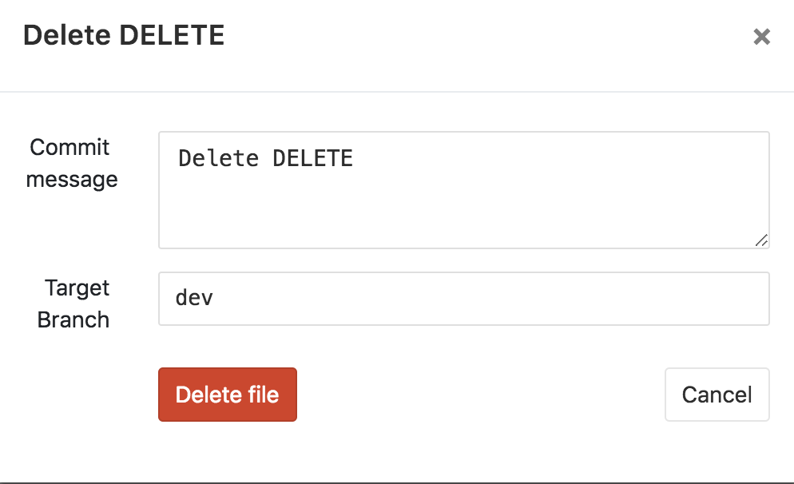

As soon as you'll do it from the GUI of *GitLab*, it will be committed.

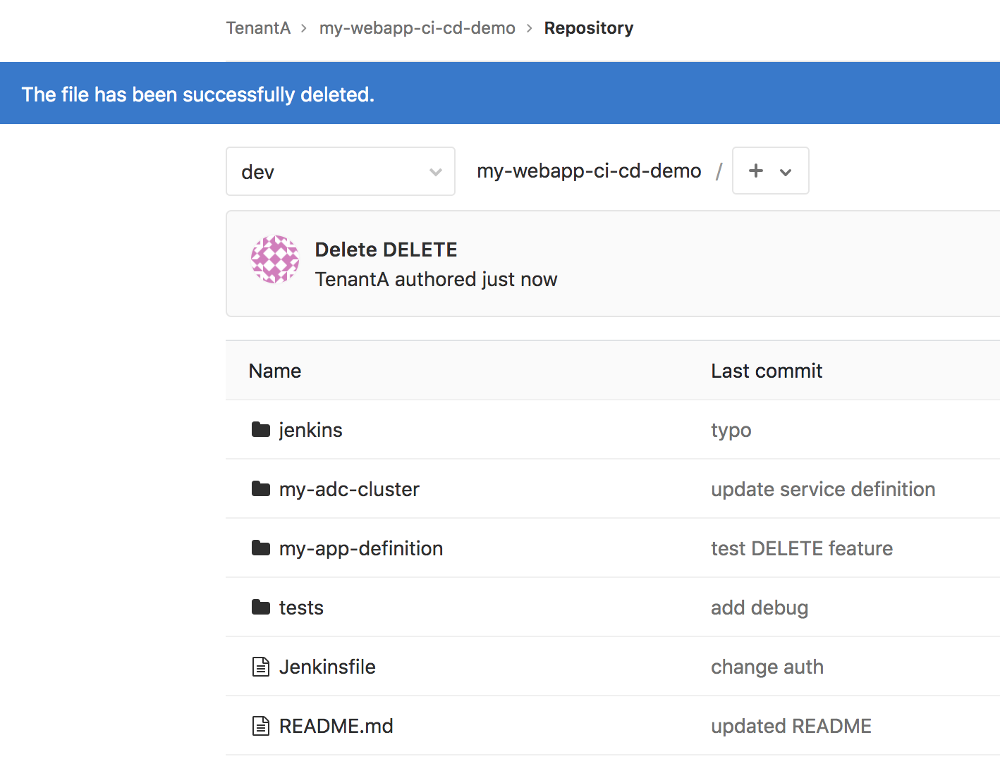

At this moment, switch to the *Jenkins* tab showing the pipeline called **my-webapp-ci-cd-demo-dev**.
You will see a new *build* being triggered after a few seconds. 

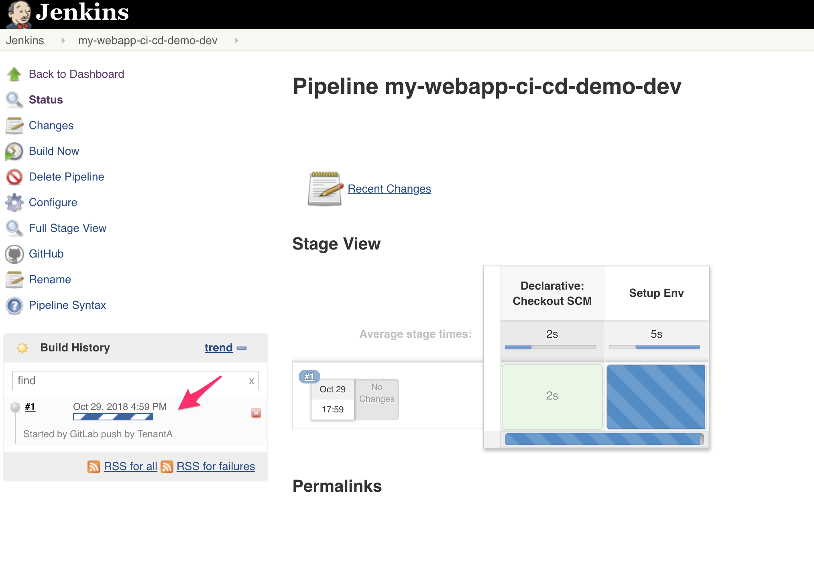

Here you can see the different steps being processed in this pipeline: 

* *build app*: the application gets deployed in Openshift
* *test app*: we run the different tests against the application and make sure we get the right response code
  (defined in the folder **tests** in the repo **my-webapp-ci-cd-demo**) 
* *build ADC services definition*: we extract the IP of the application to add it to the service definition 
  provided in the **my-webapp-ci-cd-demo** repo.
* *Test ADC Service definition*: We test this service definition against the targetted BIG-IP cluster to 
  ensure it is properly defined without errors
* *Push ADC Service definition*: We update the repo **ADC-Services** in our *Gitlab* repo to add this application
  in the right cluster. Here it is in the **cluster-nicolas** directory

If everything goes as expected, you should see the whole line of the build being green: 

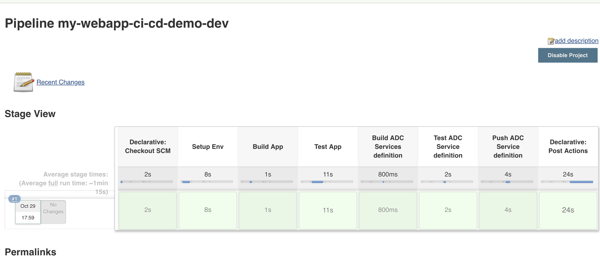

.. note:: if you have a step failing, the whole build will stop. To troubleshoot it, don't hesitate to click on the build
    number and then *Console Output*

    .. image:: ../../_static/class1/module2/img014.png
        :align: center
        :scale: 30%

    .. image:: ../../_static/class1/module2/img015.png
        :align: center
        :scale: 30%

    Here you'll see the whole pipeline being executed with all the different outputs. Check for any relevant error messages

We can check that the application has been deployed successfully, go to your minishift tab and you should see 
a new application: 

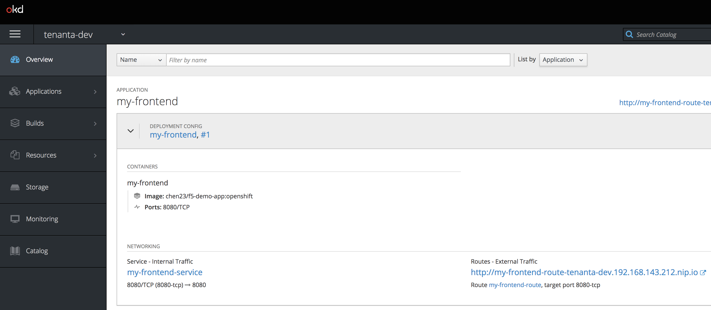

You can click on the route link to ensure the application works as expected. 

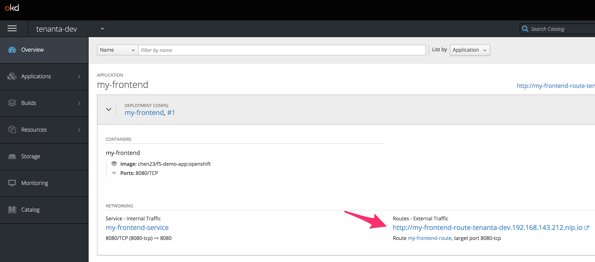

|

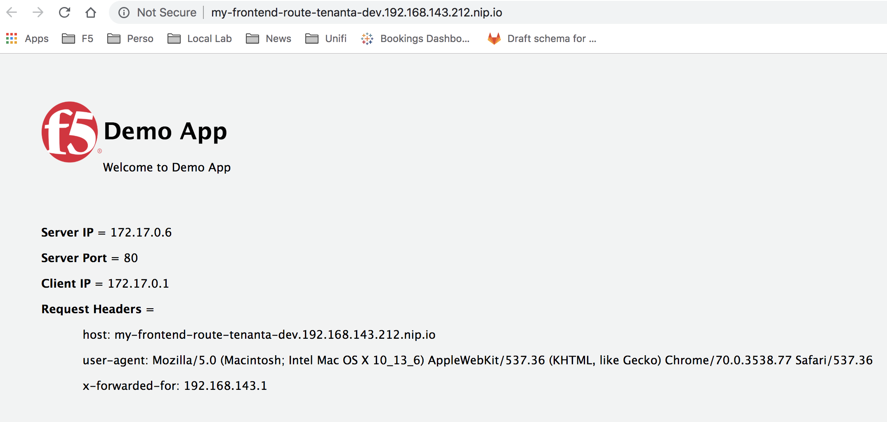

The last step of the build updated the **ADC-Services** repo to add our new application services. 

Go to the tab opened on *GitLab* and on your **ADC-Services** repo (make sure to be in the **dev** branch!).

Click on the folder **cluster-nicolas**. you should see a new directory called **my-webapp-ci-cd-demo**. 
This was pushed by our pipeline processed by *Jenkins*

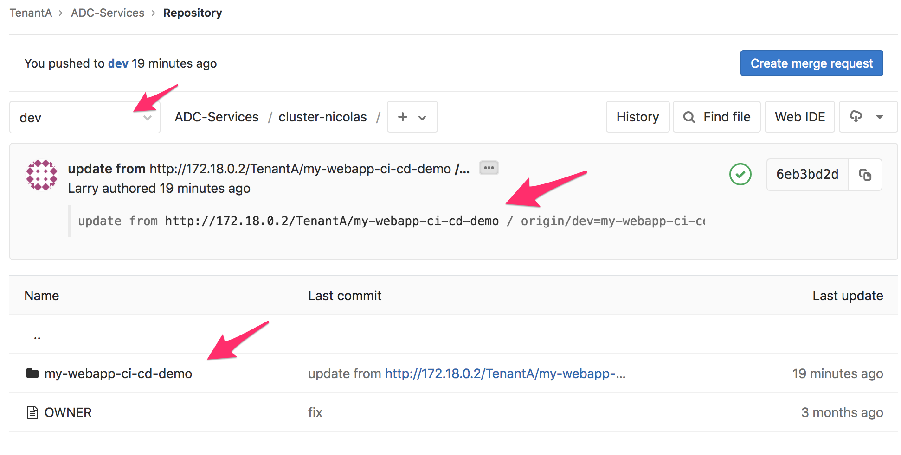

Click on this newly provisioned folder **my-webapp-ci-cd-demo**

You'll see two files: 

* service-definition: it contains the service definition that was provided by the app owner in the other repo. 
  This service definition was updated with the relevant pool member delivering the app (minishift IP)
* tests.json: we also copied the *tests* file from the application repo since we want to make sure the same tests 
  will behave in an identical manner through the ADC

We can review the *commit* that was done by the *CI server* *Jenkins* by clicking on the *commit* menu

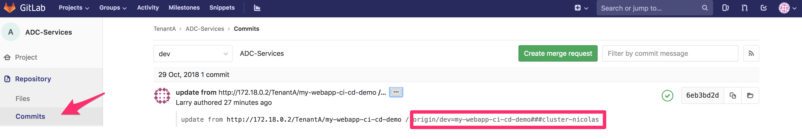

Here we can see that the commit message provide some useful information that will be used later: the application name and 
which BIG-IP cluster has been targetted for this new ADC service. 

Since we updated the **ADC-Services** repo, it also triggered a *WebHook* to the *CI Server* *Jenkins*. Go to your 
other tab on *Jenkins* related to the project called **adc-services-dev**. You will see that a *build* has also 
been triggered: 

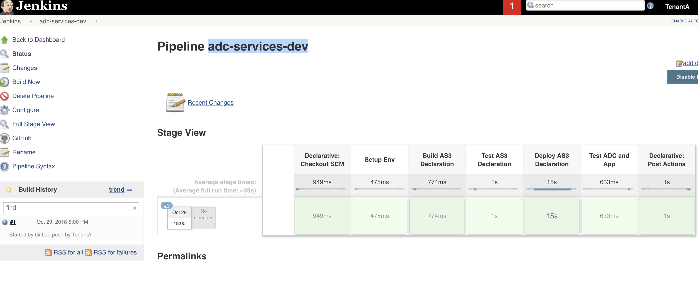

Here are the different steps of this build: 

* *Build AS3 Declaration*: We identify which cluster has been updated based on the commit log that we reviewed previously. 
  We will parse all the application folders in the relevant BIG-IP cluster to create a single AS3 declaration for the whole
  tenant. The AS3 tenant name will be based on the *Gitlab* tenant (ie TenantA) and the related branch (*dev*)
* *Test AS3 Declaration*: we do a *dry run* of the AS3 declaration to make sure no errors, mistakes are identified
* *Deploy AS3 Declaration*: if the previous *dry run* is successful, we *deploy* this time the AS3 declaration
* *Test ADC and App*: We run the different tests against the updated BIG-IP to ensure all the tests still behave as expected

If everything is processed properly, the whole build line should be green as you may see on the picture above.

You can go to your BIG-IP tab, to see if a new application service has been deployed: 

* Select the partition *tenanta-dev*
* check the virtual server and its description. The description of the VS will be the name of the application to which we appended the branch name

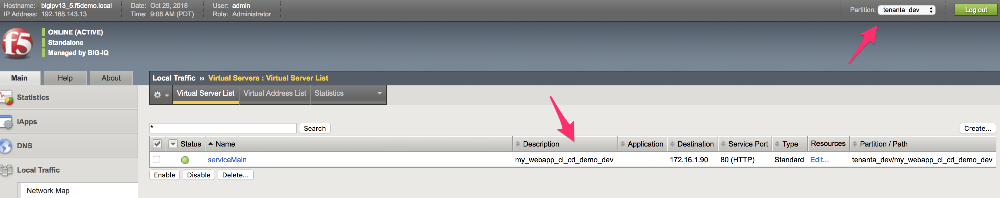

Check the settings of the Virtual Server to show that a WAF policy has been assigned to it. 

You can try to reach the application through the BIG-IP now. Be aware that you'll need to either: 

* update your hosts file to add the minishift/openshift FQDN of the app and tie it to your virtual server IP
* use the IP but you need to enforce a *Host header* with the right fqdn 

This is because Openshift/Minishift route based on the FQDN of the app. 

In this example, the FQDN to use is : my-frontend-route-tenanta-dev.192.168.143.212.nip.io
