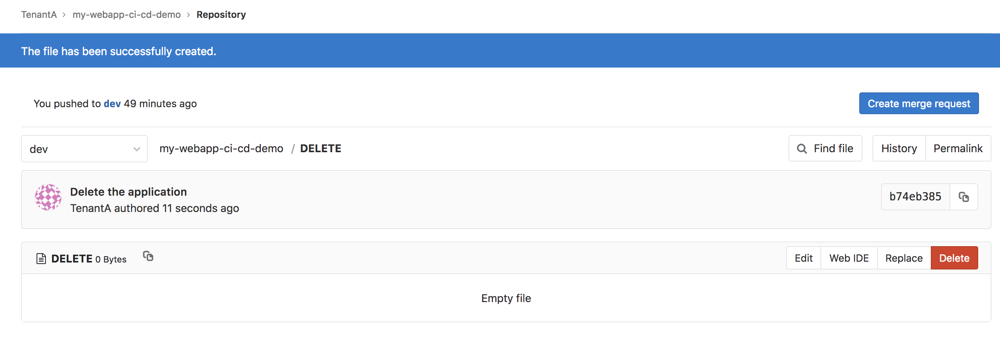
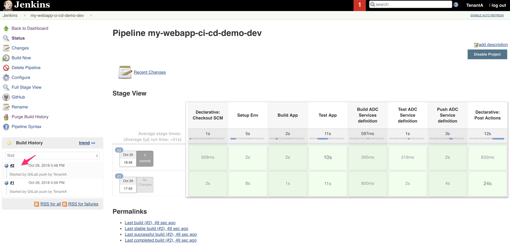

Remove the application
----------------------

We expect that you still have the different tabs opened during the previous lab: 

* 2 *GitLab* tabs: one for the **my-webapp-ci-cd-demo** repo and the other one for the 
  **ADC-Services** repo. **don't forget to go to the DEV branch**. 
* 2 *Jenkins* tabs: one for the **my-webapp-ci-cd-demo-dev** project and the other one 
  for the **adc-services-dev** project. **don't forget to go to the DEV branch**. 
* 1 tab on your BIG-IP to show its configuration
* 1 tab on your minishift deployment (*login*: dev, *password*: dev). Go in the *tenanta-dev* project

Trigger the removal
^^^^^^^^^^^^^^^^^^^

To trigger the removal of the application, it is fairly straightforward: we simply need to add a *DELETE* 
file back into the **my-webapp-ci-cd-demo** repo. 

#. Go to the tab opened showing your repo **my-webapp-ci-cd-demo** repo. Make sure to be in the **dev** branch
#. Click on the *+* sign and select *new file*

  .. image:: ../../_static/class1/module2/img023.png
    :align: center
    :scale: 30%

#. Call the file *DELETE*. If you want to put a custom *commit* message, feel free to do so. 
#. Click on *Commit changes*

  .. image:: ../../_static/class1/module2/img024.png
    :align: center
    :scale: 30%

| 

As soon as you've done this. The *WebHook* will be triggered and you'll see a new build happening on 
the *CI Server Jenkins*. Go to the tab open on *Jenkins* and showing the projet **my-webapp-ci-cd-demo-dev** 

Here we can see that a new build has been processed and its all green. It means that: 

* The application should have been removed from Minishift: 

  .. image:: ../../_static/class1/module2/img027.png
    :align: center
    :scale: 30%

* Our *GitLab* repo **ADC-Services** should have the directory called **cluster-nicolas** empty except for an *OWNER* 
  file. Validate this by going to your opened tab on *GitLab* and showing the **ADC-Services* repo: 

  .. image:: ../../_static/class1/module2/img028.png
    :align: center
    :scale: 30%  

* Since we updated the *GitLab* **ADC-Services** repo, the other *pipeline* should have been triggered. Go to your tab 
  opened on *Jenkins* and on the job called **adc-services-dev**. A new build should have been triggered: 

   .. image:: ../../_static/class1/module2/img029.png
    :align: center
    :scale: 30%

* The pipeline has been successfull so we can validate that the configuration was also removed from our BIG-IP. Since the 
  partition is empty, AS3 will have removed it also. There is no more *tenanta-dev* partition. 

   .. image:: ../../_static/class1/module2/img030.png
    :align: center
    :scale: 30%
