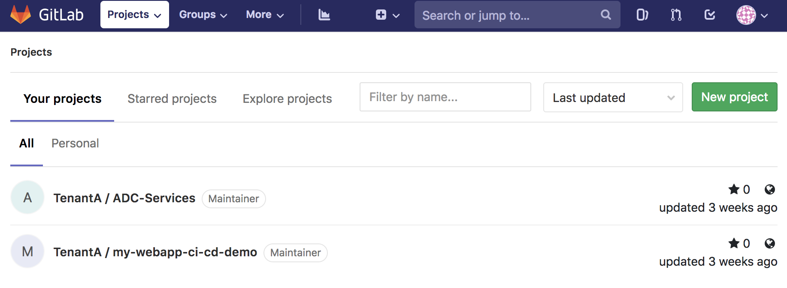
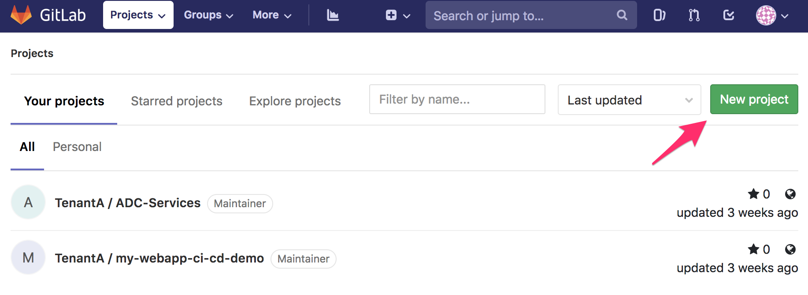
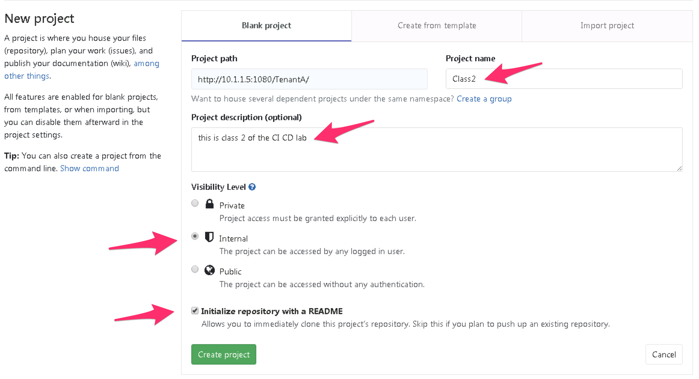
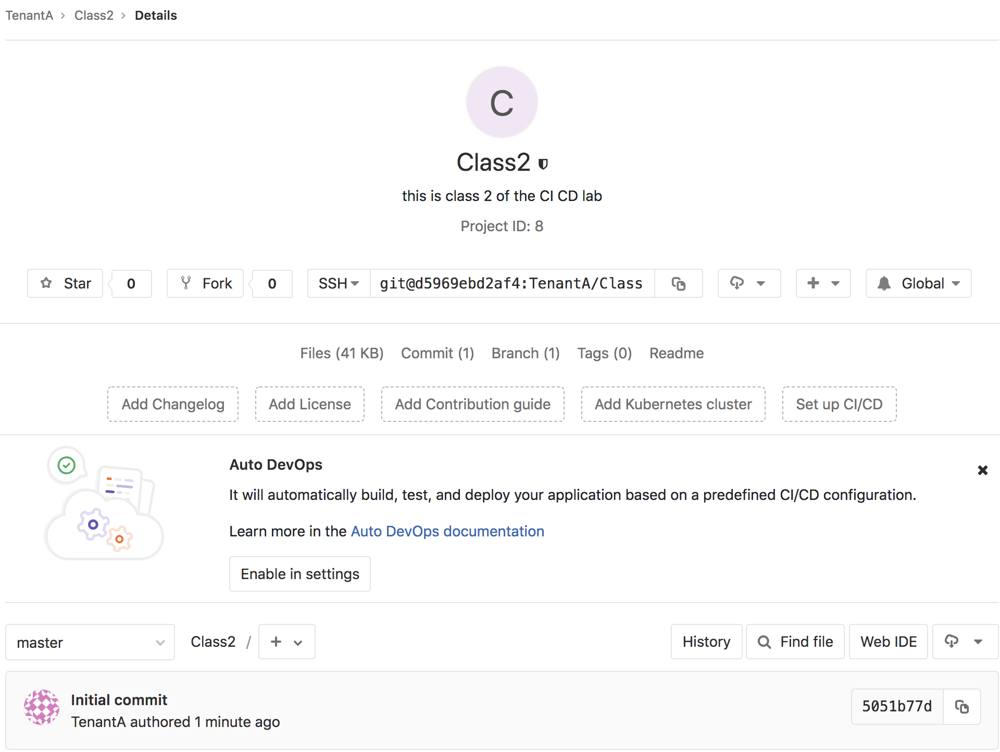
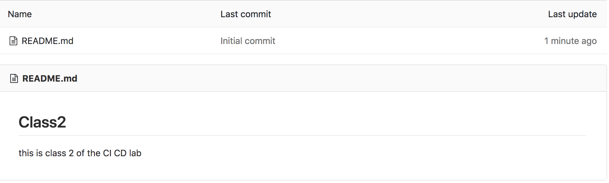

Setup a new GitLab repo
-----------------------

In this lab, we will create a new repo called **Class2** on *GitLab*.

Access GitLab
^^^^^^^^^^^^^

Connect to *GitLab*. It should be http://<your VM IP>:1080/

* Login: TenantA
* Password: Pa55w0rd

.. note:: If you use UDF (F5 private cloud), you ``must`` use the RDP Jumphost to access *GitLab*. 
    You have a shortcut on Chrome to access it. 

    .. image:: ../../_static/class2/module1/img006.png
        :align: center
        :scale: 50%

|

Create the new repo
^^^^^^^^^^^^^^^^^^^

Click on the *New project* button.

You'll get a new page asking about the project information:

* Project name: Class2
* Project description: this is class 2 of the CI CD lab
* Visibility level: Internal
* Check the box for the *Initialize repository with a README* option

.. note:: If you use UDF, don't use the GitLab HTTP access to do this. You need to use the jumphost to do this. Otherwise 
    the project path will not be good. 

In the next lab, we will update our *GitLab* repo. 