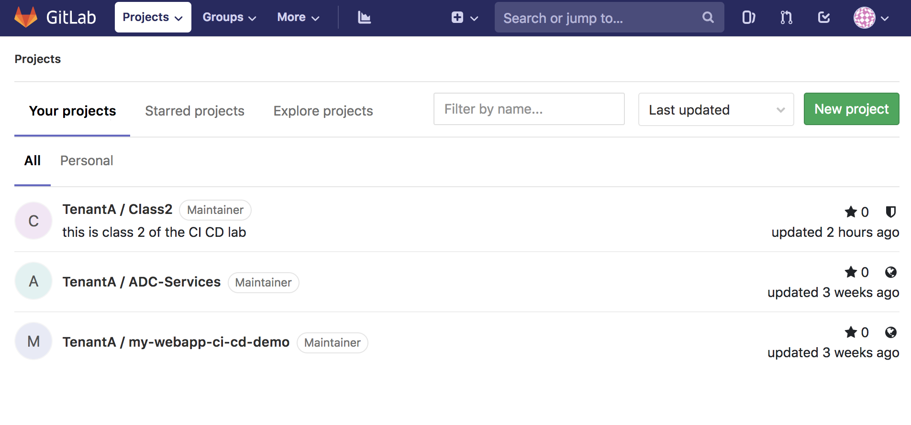
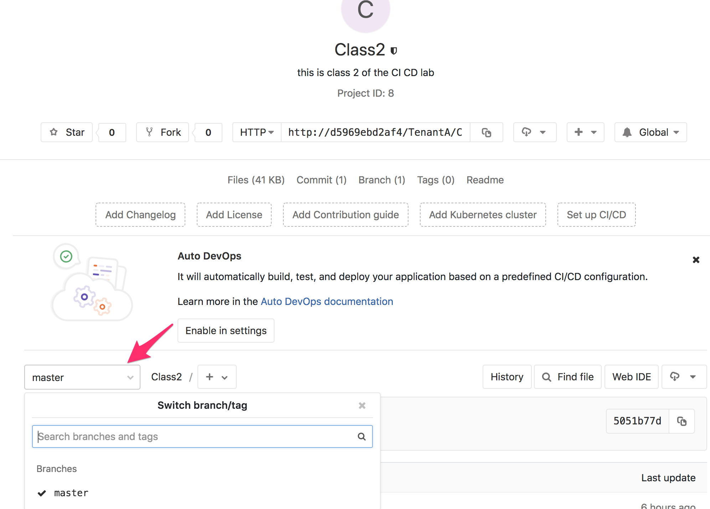
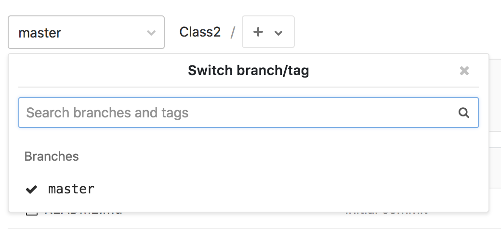
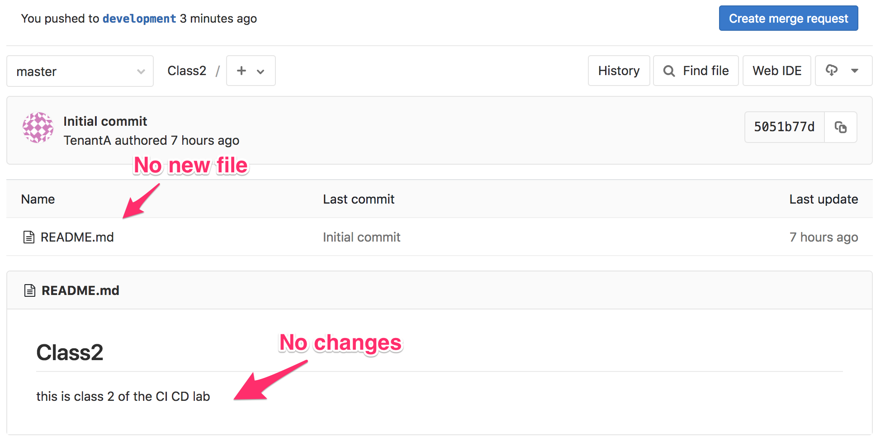
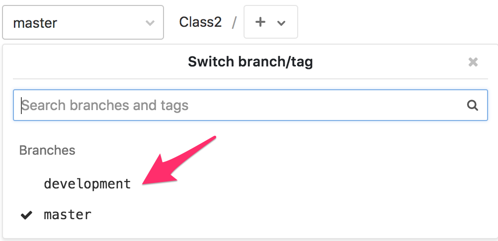
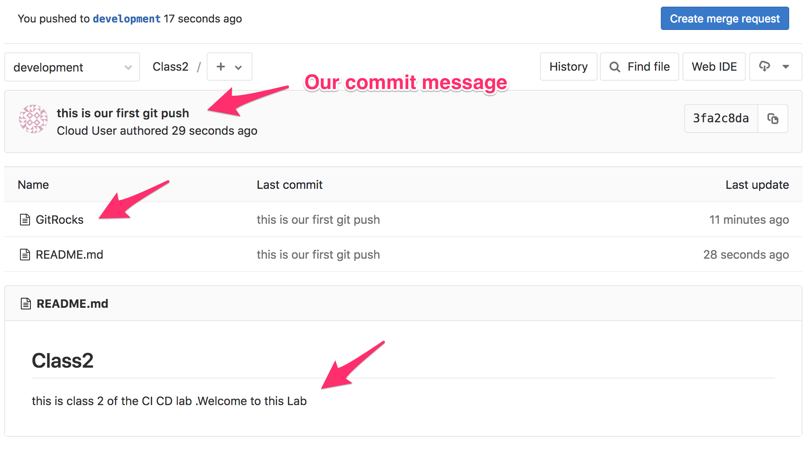

Update the GitLab repo
----------------------

Access GitLab
^^^^^^^^^^^^^

In this lab, we will update our new repo called **Class2** on *GitLab*.

Connect to *GitLab*. It should be http://<IP of your VM>:1080/

* Login: TenantA
* Password: Pa55w0rd

.. note:: If you use UDF (F5 private cloud), you may use the RDP Jumphost to access *GitLab*
    or the direct HTTP access from UDF interface

    .. image:: ../../_static/class2/module1/img006.png
        :align: center
        :scale: 50%
    
    |
    
    .. image:: ../../_static/class2/module1/img016.png
        :align: center
        :scale: 50%

| 

On *GitLab*, Click on the project **class2**

.. image:: ../../_static/class2/module1/img008.png
    :align: center
    :scale: 50%

You will see this: 

.. image:: ../../_static/class2/module1/img009.png
    :align: center
    :scale: 50%

It is fairly rare that people will handle/manage their repositories (*repo*) through the GUI. 
People will use *git* commands to handle it. *git* is available through well known editors like 
*VS Code*, *Atom*, ... but it can also be managed through CLI. We will use our CLI to do this lab. 

Update the new repo
^^^^^^^^^^^^^^^^^^^

for this lab we will consider the following: 

* If you use your own lab, you'll need access to the VM hosting *GitLab* from your terminal (via SSH)
* If you use UDF.  you can either use the **Jumphost** and the *Git Bash* app OR ``open a SSH connection
  to the CI/CD System``

Once you are connected to your system, we need to retrieve our *repo*. Our repo is 
available on *Gitlab* on a URI that is structure this way: 
**/<Tenant Name>/<Project Name>.git**

Run the following command: 

.. code:: 

    git clone http://<your VM IP>:1080/TenantA/Class2.git

.. note:: you need to make sure that *git* is installed on your system. 

You should see the following:

.. code:: 

    [centos@ip-10-1-1-5 ~]$ git clone http://10.1.1.5:1080/TenantA/Class2.git
    Cloning into 'Class2'...
    Username for 'http://10.1.1.5:1080': TenantA
    Password for 'http://TenantA@10.1.1.5:1080':
    remote: Enumerating objects: 3, done.
    remote: Counting objects: 100% (3/3), done.
    remote: Total 3 (delta 0), reused 0 (delta 0)
    Unpacking objects: 100% (3/3), done.

.. note:: Remember that the login is *TenantA* and password is *Pa55w0rd*

We can see now that a new directory is available called **Class2**. Go into this 
directory and check the content

.. code::

    [centos@ip-10-1-1-5 ~]$ ls
    ci-cd-env-setup  Class2
    [centos@ip-10-1-1-5 ~]$ cd Class2
    [centos@ip-10-1-1-5 Class2]$ ls
    README.md
    [centos@ip-10-1-1-5 Class2]$ cat README.md
    # Class2

    this is class 2 of the CI CD lab

Now we have a copy of our *repo* locally. However any changes done locally will not be replicated 
automatically on *GitLab*.

run the following command: 

    git branch

You should see this: 

.. code:: 

    [centos@ip-10-1-1-5 Class2]$ git branch
    * master

This is also what we see in the GUI of *GitLab*

As we can see in the GUI, right now we have only one branch and it is called **master**. 
Usually we consider the **master** branch, the offical branch of the *repo*. This is the 
branch you usually want to check for the latest viable/stable/recommended version of a 
*repo*. 

When people want to work on a new version of the project, a new feature of the project, an 
extension to it, ... they will create a new *branch*. By default, this new *branch* will be 
identical to the *master* branch until you start changing stuff in it. We will be able to 
merge later our changes into the **master** branch (when required)

If you want to know more about *branch*, you can review this link: Branch_.

.. _Branch: https://git-scm.com/book/en/v1/Git-Branching-What-a-Branch-Is

Let's create our new branch, we will call it **development**

run the following commands: 

.. code:: 

    git branch development

    git branch

    git checkout development

    git branch

You should see something like this: 

.. code:: 

    [centos@ip-10-1-1-5 Class2]$ git branch
    * master
    [centos@ip-10-1-1-5 Class2]$ git branch development
    [centos@ip-10-1-1-5 Class2]$ git branch
      development
    * master
    [centos@ip-10-1-1-5 Class2]$ git checkout development
    Switched to branch 'development'
    [centos@ip-10-1-1-5 Class2]$ git branch
    * development
      master
    [centos@ip-10-1-1-5 Class2]$

When you run the ``git branch`` command, it will show you all the branches you have 
but also which *branch* is active. You can see the active *branch* by the "*" before 
the branch name

We have a new branch now called **development** and we will work on it. Remember that 
our changes are **LOCAL**. Nothing is yet on *GitLab*. You can review this by checking 
your *GitLab* GUI again and look for a new *branch*. 

Let's update the README.md file and create a new file. 

To create the new file, run the following command: 

.. code::

    echo "git is awesome" > GitRocks

To update the README.md file, run the following command: 

.. code:: 

    echo ".Welcome to this Lab" >> README.md

If you check your folder now, you should have a new file called **Gitrocks** and an updated *README.md* file

We need to push our changes on *GitLab*: 

.. code:: 

    git add .

This command will add files to the index

.. code::

    git commit -m "this is our first git push"

This command will record the changes in our repository and add a message related to our changes

.. code:: 

    git push origin development

This command will update the remote *repo* on *GitLab* and create the relevant *branch* on *GitLab*

You should see something like this: 

.. code:: 

    [centos@ip-10-1-1-5 Class2]$ git add .
    
    [centos@ip-10-1-1-5 Class2]$ git commit -m "this is our first git push"
    [development 1e98130] this is our first git push
     Committer: Cloud User <centos@ip-10-1-1-5.us-west-2.compute.internal>
    Your name and email address were configured automatically based
    on your username and hostname. Please check that they are accurate.
    You can suppress this message by setting them explicitly:

        git config --global user.name "Your Name"
        git config --global user.email you@example.com

    After doing this, you may fix the identity used for this commit with:

        git commit --amend --reset-author

     2 files changed, 3 insertions(+), 1 deletion(-)
     create mode 100644 GitRocks
    
    [centos@ip-10-1-1-5 Class2]$ git push origin development
    Username for 'http://10.1.1.5:1080': TenantA
    Password for 'http://TenantA@10.1.1.5:1080':
    Counting objects: 6, done.
    Delta compression using up to 4 threads.
    Compressing objects: 100% (3/3), done.
    Writing objects: 100% (4/4), 389 bytes | 0 bytes/s, done.
    Total 4 (delta 0), reused 0 (delta 0)
    remote:
    remote: To create a merge request for development, visit:
    remote:   http://d5969ebd2af4/TenantA/Class2/merge_requests/new?merge_request%5Bsource_branch%5D=development
    remote:
    To http://10.1.1.5:1080/TenantA/Class2.git
     * [new branch]      development -> development

If you check your *GitLab* GUI, refresh the GUI. You'll see that the **master** branch 
doesn't have any of our changes 

If you click on the dropdown list where **master** is selected, you'll see that a new *branch* has been created. Select 
the **development** branch. 

Here you can see that: 

* we see our new file **GitRocks**
* you can see that the **README.md** file has been updated

