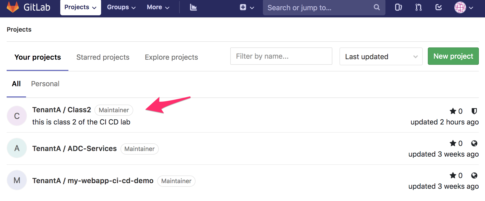
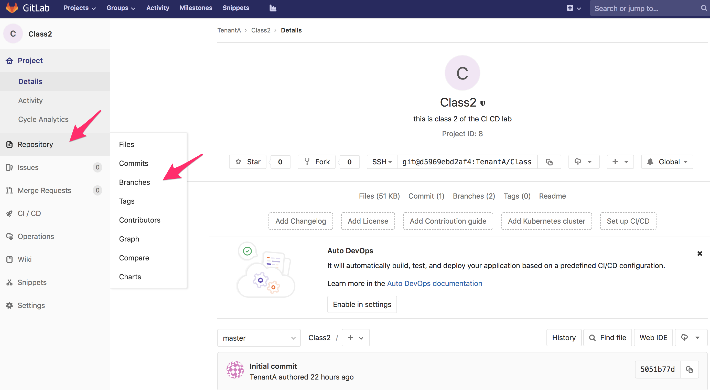
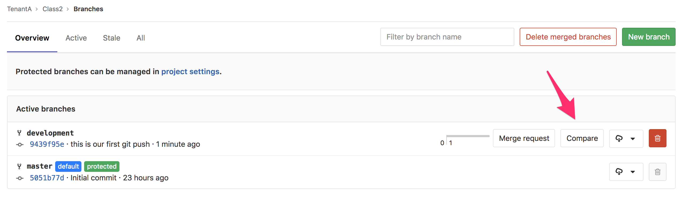
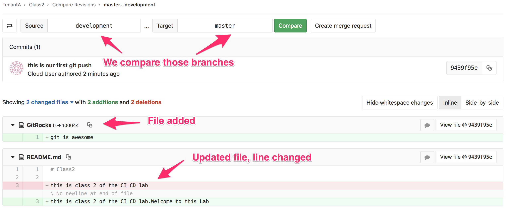
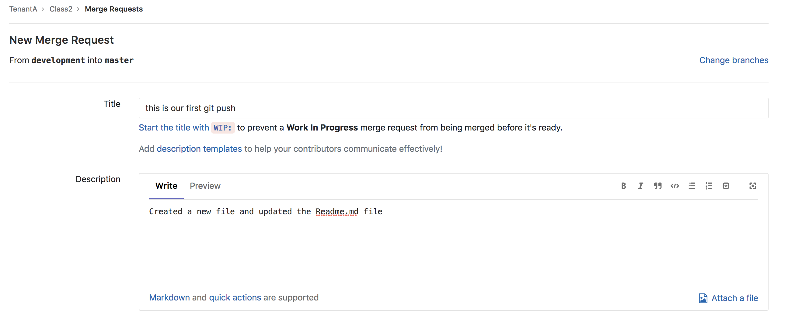
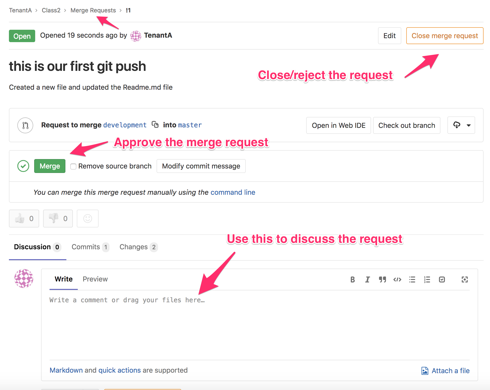
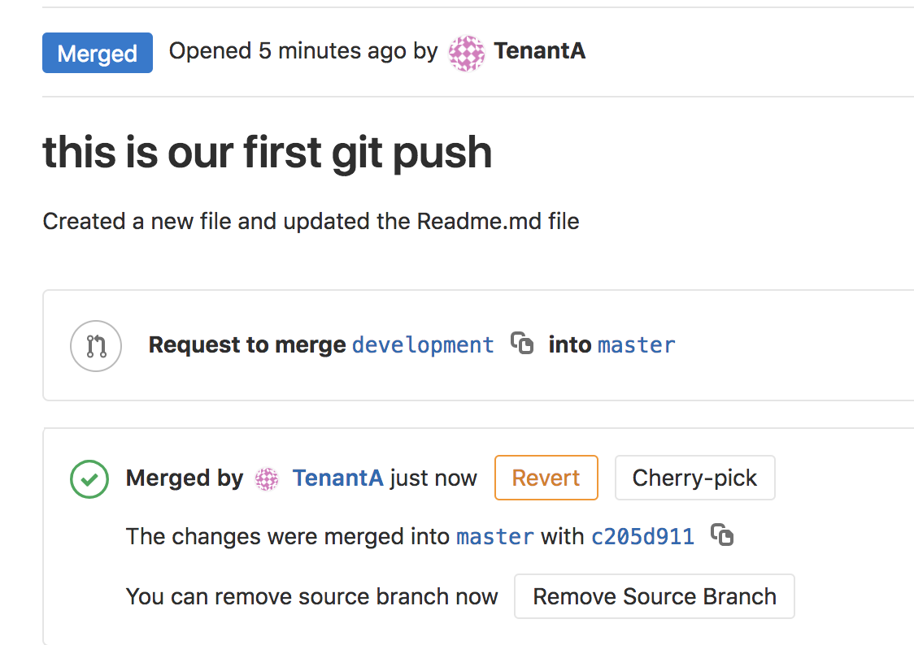
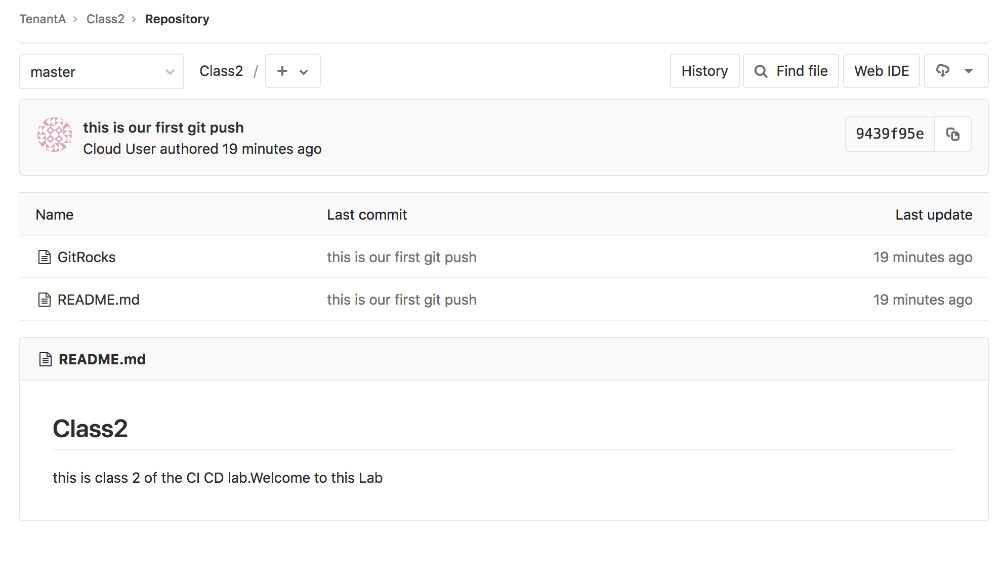

Merge branches
--------------

If you have used a *branch* to work on a new version of your project; once 
your update is done, you'll want to *merge* this branch with another branch 
like **master** to highlight that this is the latest/recommended "version" 
to use. 

In this lab, we will merge our changes from the **development** branch to 
the **master** branch. 

Merge branch via the GUI
^^^^^^^^^^^^^^^^^^^^^^^^

Connect to *GitLab*. It should be http://<IP of your VM>:1080/

* Login: TenantA
* Password: Pa55w0rd

.. note:: If you use UDF (F5 private cloud), you may use the RDP Jumphost to access *GitLab*
    or the direct HTTP access from UDF interface

    .. image:: ../../_static/class2/module1/img016.png
        :align: center
        :scale: 50%

| 

Click on the project **class2**

You will see this: 

.. image:: ../../_static/class2/module1/img009.png
    :align: center
    :scale: 50%

We can see that the **master** branch doesn't reflect the changes we did in 
the **development** branch. 

Let's merge our two **branches**. Click on *Repository* > *Branches*.

On the next screen, click on *Compare*. 

Here we can see that we are comparing our two *branch*. What you see in **green** has been 
added (text or files). What is in Red has been removed/changed. 

This window gives us the opportunity to review the difference in our **branches** 
before asking for a *merge*. We are fine with those updates so we can move forward. 

Click on *Create merge request*. The next screen shows us that we want to do a *merge request*
 from **development** into **master**.

We can see the following: 

* the *Title* of the merge request has retrieved the *commit* log we created with the ``git commit``
  command
* you can add a custom *Description* to your *merge request*. This is important if someone else will 
  approve your *merge request*. The more detailed/explicit it is, the easier it will be for the reviewer
  to check your request

Scroll down and click on *Submit merge request*. 

On this page, we can see our "official" *merge request*. Because we are the owner of this repo, 
we also have the capability to approve/reject this *merge request*. 
Here we can:

* Approve the *merge request* by clicking on the *Merge* green button
* Reject/Cancel the request by clicking on the *Close merge request* orange button
* Use the discussion area to communicate with the owner of the merge request. Since it's us, 
  there is no need here. 

Click on the *Merge* button. We can see on the next screen that our *branches* have been merged. 

.. note:: We can also delete the **development** branch if it's not needed anymore by clicking on 
    the *Remove Source Branch*. 

Click on the **master** link on this screen to be redirected to the **master** branch of this 
repository.

This is how you can do a *merge request* when you need to merge two different *branches*. 

if you want to know more about merging, you may review the *git* doc: BranchingMerging_. 

.. _BranchingMerging: https://git-scm.com/book/en/v1/Git-Branching-Basic-Branching-and-Merging