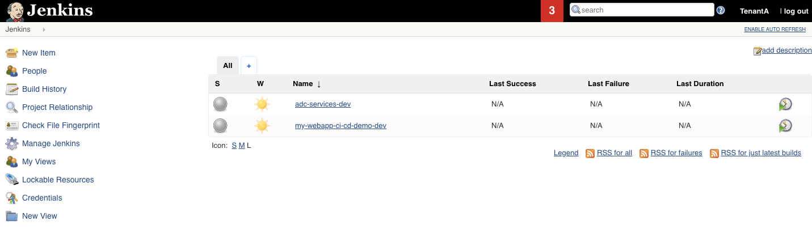
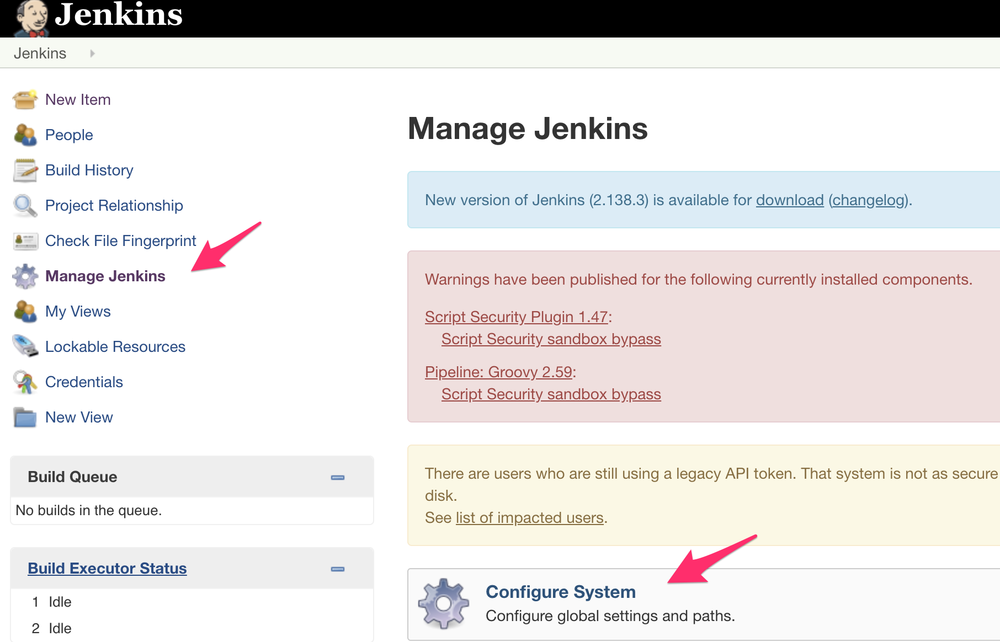
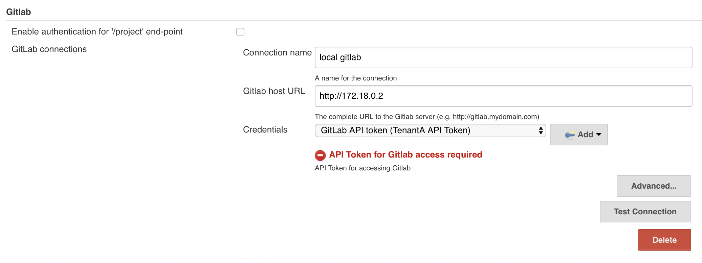
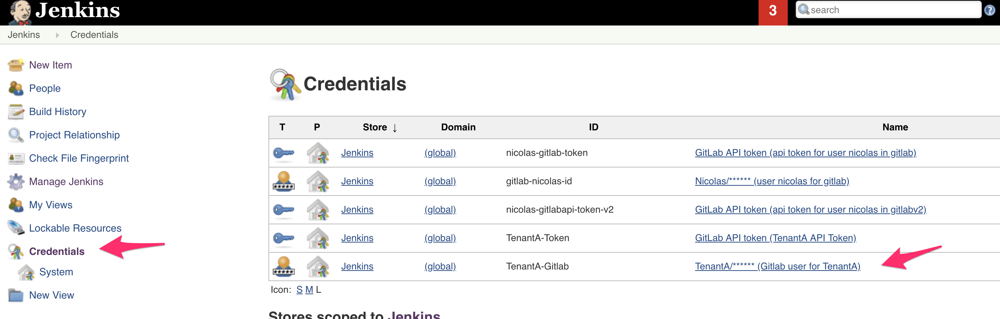
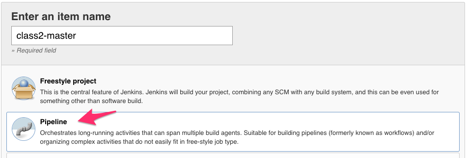
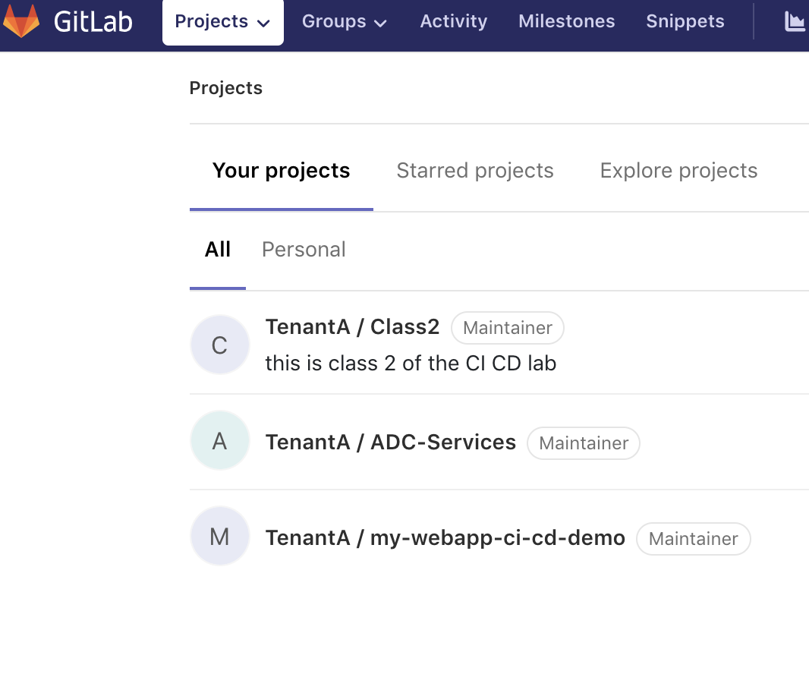
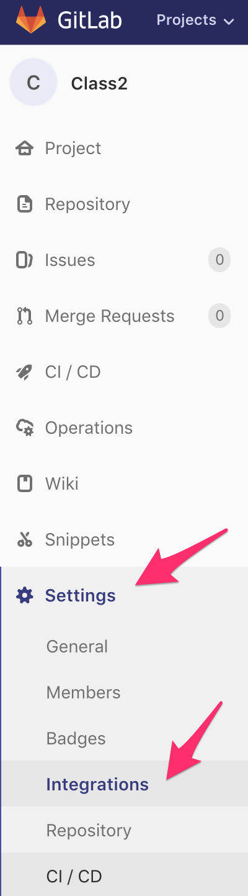
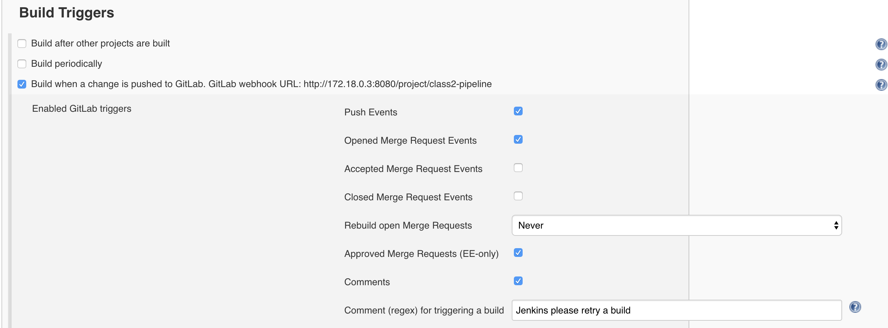
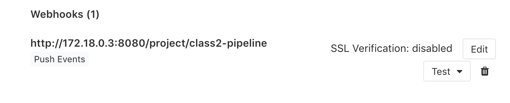
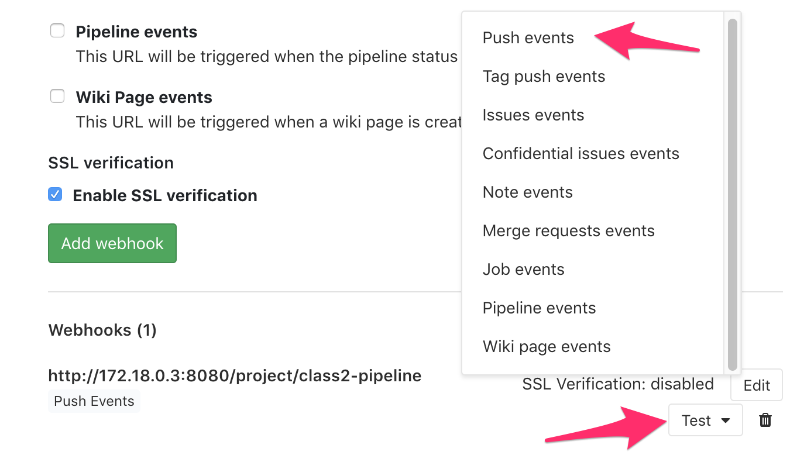

Setup a new Jenkins pipeline
----------------------------

In this lab, we will create a new pipeline called **class2-master** on *Jenkins*.

Access Jenkins
^^^^^^^^^^^^^^

Connect to *Jenkins*. It should be http://<IP of your VM>:1180/

* Login: TenantA
* Password: Pa55w0rd

.. note:: If you use UDF (F5 private cloud), you can either use the RDP Jumphost to access *Jenkins*
    or the shortcut in the interface

    .. image:: ../../_static/class2/module2/img001.png
        :align: center
        :scale: 50%

Once you're authenticated, you should see something like this: 

Since we already have some pipeline working with our *GitLab* server, some configuration has already 
been made. The main item is how to authenticate with *GitLab*. To review this setup, click on 
**Manage Jenkins** and then **Configure System**.

Scroll down to the **Gitlab** section. You'll see that we have already setup a *GitLab* connection 
called **local gitlab**. We will use this connection name later in our new *pipeline*. 

.. note:: You can see here that we referenced a credential called **GitLAb API token**. This token was 
    created in *GitLab*. To generate an *API Token*, in *GitLab* go to your *User Settings* once you're 
    authenticated as **TenantA**. 

    .. image:: ../../_static/class2/module2/img011.png
        :align: center
        :scale: 50%

    Select the **Access Tokens** and you'll see the *API Token* we referenced in *Jenkins*

    .. image:: ../../_static/class2/module2/img012.png
        :align: center
        :scale: 50%

For *Jenkins* to be able to retrieve our *repositories* from *GitLab*, we also have setup some credentials. 
On the main page, click on **Credentials**. Here you'll see an *ID* called **TenantA-Gitlab**, we will use 
this also in our new *pipeline. 

   

Create a new pipeline
^^^^^^^^^^^^^^^^^^^^^

To create a new pipeline, click on the **New Item** link. 

.. image:: ../../_static/class2/module2/img003.png
    :align: center
    :scale: 50%

Setup the following: 

* Item name: *class2-pipeline*
* Select *Pipeline*

Click **OK**. 

Here we setup the following: 

* Check **github project**. 

    * *Project url*: http://<your VM IP>:1080/TenantA/Class2 
    * *Gitlab Connection*: Select **local gitlab** 

    .. image:: ../../_static/class2/module2/img005.png
        :align: center
        :scale: 50%

* In the *Build Triggers* section, check **Build when a change is pushed to 
  GitLab. GitLab webhook URL: http://172.18.0.3:8080/project/class2-pipeline**. 
  We will need to setup this *WebHook* later in *GitLab*

    * Click on the *Advanced* button. Check the button **Filter branches by name**
      and in the *include* field: **development**

    .. image:: ../../_static/class2/module2/img006a.png
        :align: center
        :scale: 50%

    .. image:: ../../_static/class2/module2/img006b.png
        :align: center
        :scale: 50%

    .. note:: sometimes you may see an error when specifying the **development** branch. 
        Ignore the error and keep creating the *pipeline*.

* In the *Pipeline* section, Select **Pipeline script from SCM**. 

  * For the *SCM* field, select **git**
    
    * For the *Repository URL*, specify the URL for your *GitLab* project 

      .. note:: if you use UDF or the VM, here you need to specify the IP of the 
        *GitLab* container; hence: http://172.18.0.2/TenantA/Class2
  
    * *Credentials*, Select **TenantA/...** 

    * *Branches to build*: **development**. This means that we will retrieve the branch that 
      got updated and triggered the pipeline. 

  * The *Script Path* field is to mention a **File Name** that 
    *Jenkins* will look for into our repo to know what it needs to do. We will 
    have to create this file later. Here it will look for a file called **Jenkinsfile**

    .. image:: ../../_static/class2/module2/img007.png
        :align: center
        :scale: 50%

* Click on **Apply/Save**. Your pipeline has been created. 

  .. image:: ../../_static/class2/module2/img008.png
    :align: center
    :scale: 50%

We still need to do two things: 

* Create a *WebHook* in *GitLab* to trigger our *pipeline* when our repo is updated
* add a *Jenkinsfile* to our *GitLab* repo to details what we need to do when our pipeline 
  is triggered

Setup our GitLab Webhook 
^^^^^^^^^^^^^^^^^^^^^^^^

To create the *WebHook*, connect to your *GitLab* GUI. 

.. note:: reminder to login into *GitLab*

    * Login: TenantA
    * Password: Pa55w0rd

Click on your repo **TenantA / Class 2**. Click on **Settings** > **Integrations**. 

When we created our **class2-pipeline**, we saw the following during its setup: 

This is the URL we should use as our *WebHook*: http://172.18.0.3:8080/project/class2-pipeline.
In the *GitLab* GUI:

* use this URL in the *URL* field. 
* leave *Secret Token* empty. 
* uncheck *Enable SSL verification*

Click the **Add webhook** button. Once it's saved, you should see the following (you may need to 
scroll down). 

.. note:: don't use the test button it won't work. This is because we setup our pipeline to only accept 
            push events from the *development* branch. 
            
If you want to test your setup, go to your *development* branch and update the content of one of the file. 

Once you've updated one of the two files, it will trigger our webhook. 

* If you go back to the *Jenkins* GUI. You will see a red icon and 
    "stormy" cloud next our **class2-pipeline** pipeline. It means that the pipeline 
    failed. This is expected and it shows that it got triggered by our *WebHook* test.  

    .. image:: ../../_static/class2/module2/img018.png
        :align: center
        :scale: 50%

    |

    Click on the **class2-pipeline** link and then click on the latest build history number. It 
    should be #1

    |

    .. image:: ../../_static/class2/module2/img019.png
        :align: center
        :scale: 50%

    |

    Click on **Console Output** to see what happens with this *build*. 

    |

    .. image:: ../../_static/class2/module2/img020.png
        :align: center
        :scale: 50%

    You'll see the output related to our *pipeline* being executed

    .. code:: 

        Started by GitLab push by TenantA
        [Office365connector] No webhooks to notify
        [Office365connector] No webhooks to notify
        java.io.FileNotFoundException
	        at jenkins.plugins.git.GitSCMFile$3.invoke(GitSCMFile.java:167)
	        at jenkins.plugins.git.GitSCMFile$3.invoke(GitSCMFile.java:159)
	        at jenkins.plugins.git.GitSCMFileSystem$3.invoke(GitSCMFileSystem.java:193)
	        at org.jenkinsci.plugins.gitclient.AbstractGitAPIImpl.withRepository(AbstractGitAPIImpl.java:29)
	        at org.jenkinsci.plugins.gitclient.CliGitAPIImpl.withRepository(CliGitAPIImpl.java:72)
	        at jenkins.plugins.git.GitSCMFileSystem.invoke(GitSCMFileSystem.java:189)
	        at jenkins.plugins.git.GitSCMFile.content(GitSCMFile.java:159)
	        at jenkins.scm.api.SCMFile.contentAsString(SCMFile.java:338)
	        at org.jenkinsci.plugins.workflow.cps.CpsScmFlowDefinition.create(CpsScmFlowDefinition.java:110)
	       at org.jenkinsci.plugins.workflow.cps.CpsScmFlowDefinition.create(CpsScmFlowDefinition.java:67)
	        at org.jenkinsci.plugins.workflow.job.WorkflowRun.run(WorkflowRun.java:303)
	        at hudson.model.ResourceController.execute(ResourceController.java:97)
	        at hudson.model.Executor.run(Executor.java:429)
        Finished: FAILURE

    This is expected. Here it happens because we triggered the *WebHook* when the *Jenkinsfile* has not been created. 

We will setup the Jenkinsfile in our next lab. 

