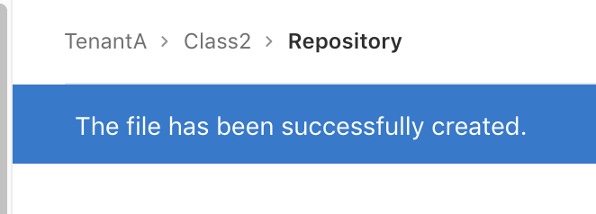
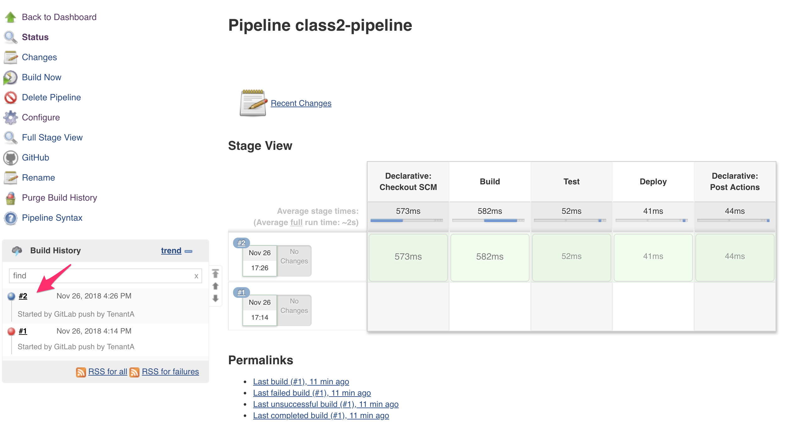
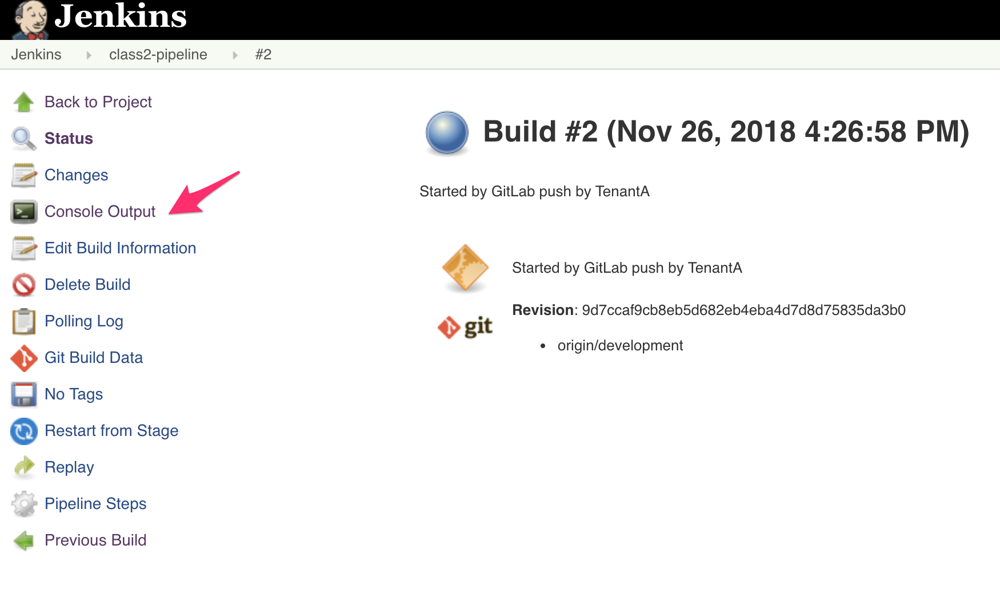

Setup the Jenkinsfile
---------------------

In this lab, we will create the relevant **Jenkinsfile**. To learn more about *Jenkinsfile*, 
don't hesitate to check this link: Jenkinsfile_. 

.. _Jenkinsfile: https://jenkins.io/doc/book/pipeline/jenkinsfile/

Create the Jenkinsfile
^^^^^^^^^^^^^^^^^^^^^^

Connect to your *GitLab* GUI and go into your **Class2** project/repository. 

.. note:: it may be a good practice for you to try to do the same in CLI. 

Select your **development** branch. Click on the **+** sign and select **New file**. 

* *File Name*: **Jenkinsfile**
* in the text section, copy/paste the following: 

  .. code::

    #!groovy
    
    pipeline {
        agent any

        stages {
            stage('Build') {
                steps {
                    echo 'Building.. '
                    sh 'echo GIT branch is $GIT_BRANCH'
                    sh 'ls -l'
                }
            }
            stage('Test') {
                steps {
                    echo 'Testing..'
                }
            }
            stage('Deploy') {
                steps {
                    echo 'Deploying....'
                }
            }
        }
        post {
            always { 
                cleanWs()
            }
	    }
    }

  .. image:: ../../_static/class2/module2/img022.png
    :align: center
    :scale: 50%

  |

  Specify a Commit message, validate that you're on the **development** branch and 
  click on the **Commit changes** button. 

  .. image:: ../../_static/class2/module2/img023.png
    :align: center
    :scale: 50%

You should see a blue banner to confirm the file creation

Since we have "pushed" a change in our repo, our *Jenkins* pipeline has been triggered. Go 
back to the *Jenkins* GUI to see what happened. You should see the following in your 
**class2-pipeline** *pipeline*:

Here we can see that the *build* is successful since we got a "green" line. We can see the different 
*stages* that were listed in our *Jenkinsfile* ! Build, Test, Deploy. 

If you want to know more, click on the *build* number on the bottom left. 

Here you'll see the different *stages* of your *pipeline* execution. 

Jenkins is notified by the *WebHook* and retrieved the *Jenkinsfile* 

.. code::

    Started by GitLab push by TenantA
    [Office365connector] No webhooks to notify
    Obtained Jenkinsfile from git http://172.18.0.2/TenantA/Class2
    Running in Durability level: MAX_SURVIVABILITY
    [Pipeline] node
    Running on Jenkins in /var/jenkins_home/workspace/class2-pipeline

Then it starts to execute our *Jenkinsfile*. You can follow the processing of our file through the 
light grey text. the dark grey text is the output of what is executed. 

We specified in our *pipeline* configuration that we wanted to checkout the SCM so it 
retrieves the **developement** branch of our *repo*

.. code::

    [Pipeline] { (Declarative: Checkout SCM)
    [Pipeline] checkout
    Cloning the remote Git repository
    Cloning repository http://172.18.0.2/TenantA/Class2
     > git init /var/jenkins_home/workspace/class2-pipeline # timeout=10
    Fetching upstream changes from http://172.18.0.2/TenantA/Class2
     > git --version # timeout=10
    using GIT_ASKPASS to set credentials Gitlab user for TenantA
     > git fetch --tags --progress http://172.18.0.2/TenantA/Class2 +refs/heads/*:refs/remotes/origin/*
     > git config remote.origin.url http://172.18.0.2/TenantA/Class2 # timeout=10
     > git config --add remote.origin.fetch +refs/heads/*:refs/remotes/origin/* # timeout=10
     > git config remote.origin.url http://172.18.0.2/TenantA/Class2 # timeout=10
    Fetching upstream changes from http://172.18.0.2/TenantA/Class2
    using GIT_ASKPASS to set credentials Gitlab user for TenantA
     > git fetch --tags --progress http://172.18.0.2/TenantA/Class2 +refs/heads/*:refs/remotes/origin/*
    skipping resolution of commit 9d7ccaf9cb8eb5d682eb4eba4d7d8d75835da3b0, since it originates from another repository
     > git rev-parse origin/development^{commit} # timeout=10
    Checking out Revision 9d7ccaf9cb8eb5d682eb4eba4d7d8d75835da3b0 (origin/development)
     > git config core.sparsecheckout # timeout=10
     > git checkout -f 9d7ccaf9cb8eb5d682eb4eba4d7d8d75835da3b0
    Commit message: "Create Jenkinsfile for pipeline processing"
    First time build. Skipping changelog.

then we start executing the content of our *Jenkinsfile*: 

.. code:: 

    stage('Build') {
        steps {
            echo 'Building.. '
            sh 'echo GIT branch is $GIT_BRANCH'
            sh 'ls -l'
    }

This is one of the *stage* we saw in the previous page (one of the green box). Here we mostly 
create some ouput for tracing purposes, highlight which branch we retrieved and then list the 
content of the directory where we are. 

this is the output of this in our console

.. code:: 

    [Pipeline] echo
    Building.. 
    [Pipeline] sh
    [class2-pipeline] Running shell script
    + echo GIT branch is origin/development
    GIT branch is origin/development
    [Pipeline] sh
    [class2-pipeline] Running shell script
    + ls -l
    total 12
    -rw-r--r-- 1 jenkins jenkins  15 Nov 26 16:26 GitRocks
    -rw-r--r-- 1 jenkins jenkins 517 Nov 26 16:26 Jenkinsfile
    -rw-r--r-- 1 jenkins jenkins  63 Nov 26 16:26 README.md    

You can see that we retrieved our *repository* but also got placed in our repository automatically. 

This is the logic of the *Jenkinsfile*. If you want to see more examples of *Jenkinsfile*, don't 
hesitate to check the files in our **ADC-Services** and **my-webapp-ci-cd-demo** repositories 

.. note:: remember to go into the **dev** branch of those *repositories*

    .. image:: ../../_static/class2/module2/img028.png
        :align: center
        :scale: 50%
    
    |

    .. image:: ../../_static/class2/module2/img029.png
        :align: center
        :scale: 50%

